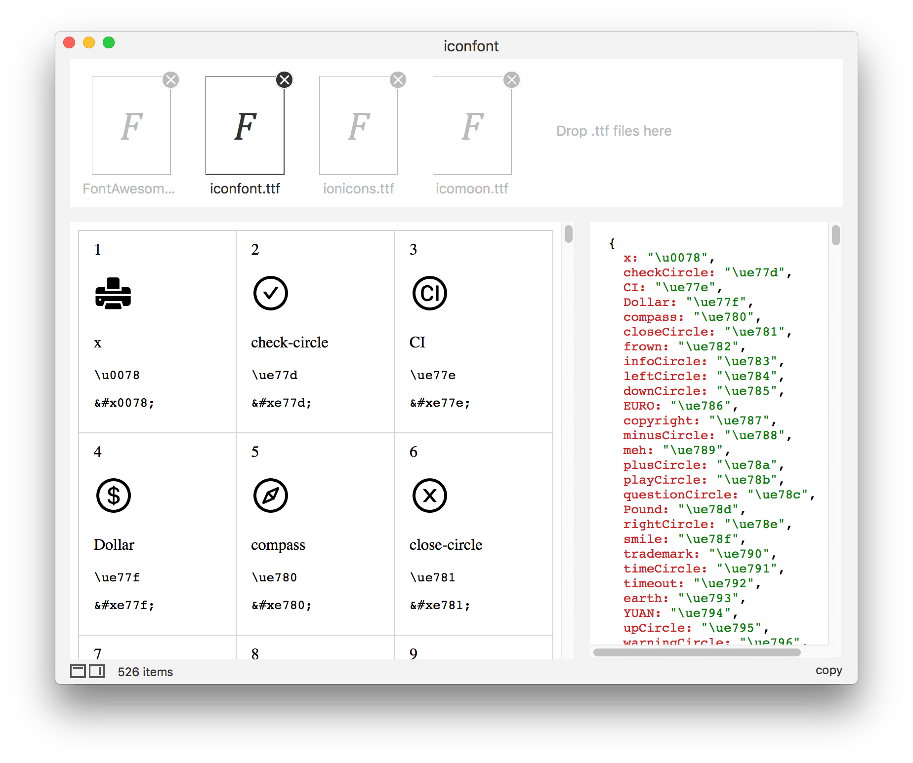

## Iconfont - 字体图标预览工具

**已上架Mac App Store**

#### <a href="https://itunes.apple.com/cn/app/iconfont/id1518516582">**Iconfont**</a>
> macos 10.11+ required

</br>

- 支持拖拽放置、右键打开 **.ttf** 文件。
- 可直接复制 **unicode** 编码。
- name 和 unicode 映射的文件，name自动转为驼峰命名。

</br>	

 **[Iconfont](https://itunes.apple.com/cn/app/iconfont/id1518516582)** is  a previewer for **.ttf** file. 

- You can drag&drop one or more .ttf files.
- You can copy the mapped text and json.
- `&#x0078 `and  `\u0078` **unicode** is very useful for developers.   

</br>

| 字体图标网站 ( **icon fonts  library** )        |
| ----------------------------------------------- |
| [icomoon.io](https://icomoon.io/app/#/select)   |
| [iconfont.cn](http://www.iconfont.cn/)          |
| [fontawesome](http://fontawesome.dashgame.com/) |

</br>

###  preview


</br>

### screenshots



</br>

### 使用 

1. 本项目基于 [react-native-macos](https://github.com/ptmt/react-native-macos) ，所有请确保你已安装 react-native-macos。

2. 安装依赖包：

   ```shell
   $ cd iconfont
   $ npm install
   ```
3. 直接使用 **Xcode** 打开 `macos/iconfont.xcodeproj` 文件， 编译运行。

</br>

### [打赏 (Donation)](https://github.com/iHongRen/Donation/blob/master/Donation.md)


</br>
